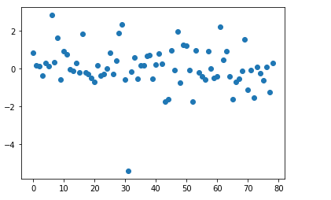
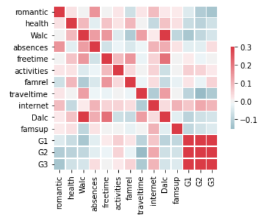

# Data Science Student Performance Estimator: Project Overview 
* Created a tool that estimates the final grade of a student to help the school to predict the perfomance of their students and use it in various ways.
* Engineered features from data imported in a csv file. 
* Optimized Linear, Lasso, and Random Forest Regressors using GridsearchCV to reach the best model. 
* Built a client facing API using flask 

## Code and Resources Used 
**Python Version:** 3.8  
**Packages:** pandas, numpy, sklearn, matplotlib, seaborn, selenium, flask, json, pickle  
**For Web Framework Requirements:**  ```pip install -r requirements.txt```   
**Flask Productionization:** https://towardsdatascience.com/productionize-a-machine-learning-model-with-flask-and-heroku-8201260503d2


## Data Columns
The Data consist of the following:
*	school
*	sex
*	age
*	address
*	famsize 
*	Pstatus
*	Medu 
*	Fedu
*	Mjob
*	Fjob 
*	reason
*	guardian
*	traveltime
*	studytime 
*	failures 
*	schoolsup 
*	famsup 
*	paid 
*	activities 
*	nursery 
*	higher 
*	internet 
*	romantic 
*	famrel 
*	freetime 
*	Dalc 
*	Walc 
*	goout 
*	health 
*	absences 
*	G1 , G2 , G3

## Data Cleaning
After importing the data , I had to make a changement in order to make my data more usable for the model :

*	Eliminated some columns that were not correlated with the final grade 'G3'

## EDA
I looked at the distributions of the data . Below are a few highlights from the plot. 




## Model Building 

First, I transformed the categorical variables into dummy variables. I also split the data into train and tests sets with a test size of 20%.   

I tried three different models and evaluated them using Mean Absolute Error. I chose M A E because it is relatively easy to interpret.   

I tried three different models:
*	**Linear Regression** – Baseline for the model
*	**Lasso Regression** – I thought a normalized regression like lasso would be helpful in my case.
*	**Random Forest** – Because of the sparsity associated with the data, I thought that this would be a good fit , and I tried to play with differents parameters all a long. 

## Model performance
The Random Forest model far outperformed the other approaches on the test and validation sets. 
*	**Random Forest** : MAE = 0.757
*	**Linear Regression**: MAE = 0.953
*	**Ridge Regression**: MAE = 0.900

## Productionization 
I built a flask API endpoint that was hosted on a local webserver by following along a tutorial . The APi takes a list of values of a student's case and returns an estimated grade of his final exam. 


